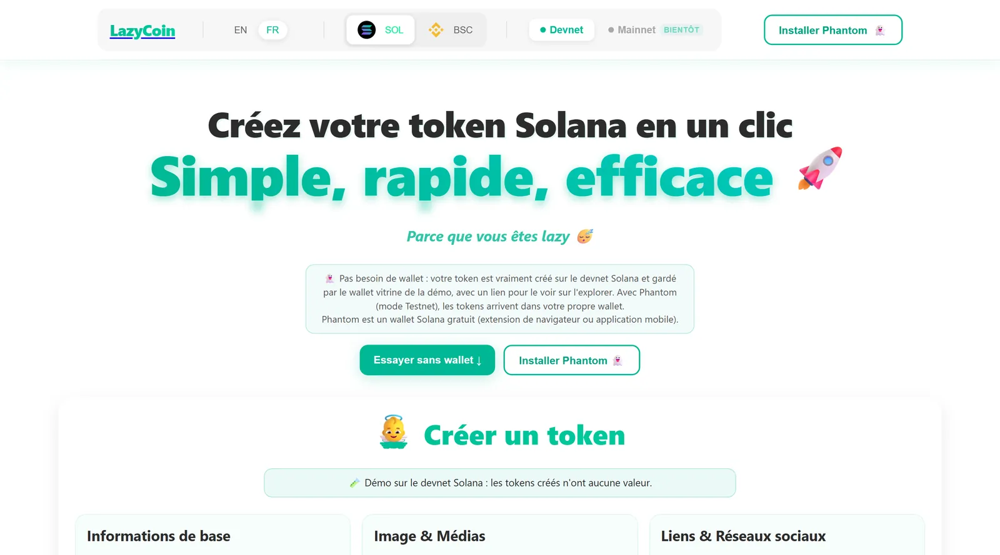
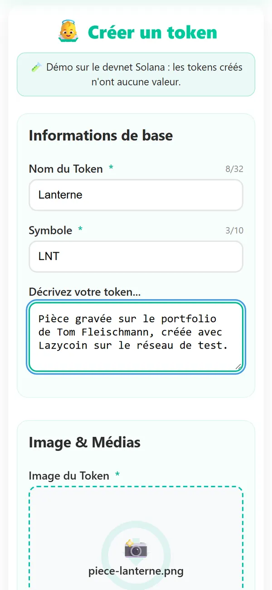

# Lazycoin

Un formulaire web pour créer un token sur Solana sans passer par le terminal.



## Ce que fait le projet

Créer un token sur Solana demande normalement une suite de commandes dans un terminal : générer une adresse, créer le token, l'héberger sur IPFS, écrire ses métadonnées, régler les droits. Lazycoin remplace tout ça par un seul formulaire : un nom, un symbole, une image, quelques liens. Le serveur fait le reste et rend un rapport lisible avec l'adresse du token et le lien vers l'explorateur.

Le réseau de test (devnet) est utilisé par défaut : les tokens créés n'ont aucune valeur et se tromper ne coûte rien.



## Pourquoi

Je voulais voir si je pouvais mener un projet complet avec l'IA, du front au serveur, sur une technologie que je ne connaissais pas. Le résultat : environ 30 secondes du formulaire au token, au lieu d'une heure de commandes.

## Stack

- Front : React (Create React App), interface en français et en anglais
- Serveur : Node.js (Express), progression envoyée au navigateur en temps réel (SSE)
- Script de création : Python, outils Solana CLI et SPL Token dans un conteneur Docker
- IPFS via Pinata pour l'image et les métadonnées

## Lancer en local

```bash
npm install
npm start                      # front sur http://localhost:3000

cd backend
cp .env.example .env           # remplir les valeurs, devnet uniquement
npm install
node server.js
```

Le script Python s'appuie sur une image Docker décrite dans `backend/Dockerfile`.

## Avertissement

Projet d'apprentissage, écrit en février 2025. Ce n'est pas un produit financier et ce dépôt n'encourage ni l'achat ni la vente de tokens : il sert à comprendre comment un token est créé. Utilisez uniquement le réseau de test et un portefeuille dédié, jamais une clé qui détient des fonds.

Les captures montrent la démo en ligne, retouchée en 2026 ; le code de ce dépôt est la version de 2025.
